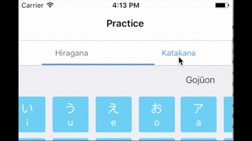
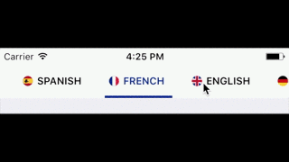
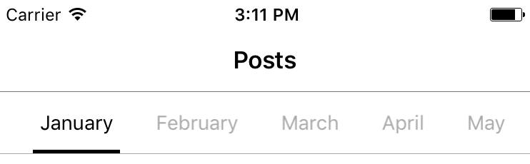

# PagedContent - Easy to use library to display content with multiple sections

PagedContent is an iOS implementation of Android's ViewPager purely written in Swift. It allows to place content in "pages" in order to show one part of the content while hiding others. It uses a menu-based navigation to go through the different parts of the content.

  

## Usage

The easiest way to use the component is to embed the `PagedContentViewController` in your view controller using a container view, or to initialize a `PagedContentViewController` in your parent view controller and adding it's view to your main view.

To setup each page of the content, you must create a `PagedContentTab` object with a title and a `UIView` object which will be the content of that page; and pass a list of these objects to the `PagedContentViewControler`. An example of this is as the following:

```swift
let backgroundColors = [UIColor.blue, UIColor.red, UIColor.yellow, UIColor.brown, UIColor.cyan, UIColor.green, UIColor.black]
        
        let tabs = ["view1", "view2", "view3", "view4"].enumerated().map { index, title -> PagedContentTab in
            
            let view = UIView()
            view.backgroundColor = backgroundColors[index]
            return PagedContentTab(title: title, view: view)
        }
pagedContentViewController?.update(tabs: tabs)
```
**Tabs with image and title:**

To setup the tab menu with title and images you just have to pass an additional `UIImage` object when initializing the `PagedContentTab`, as the following:

```swift
PagedContentTab(title: title, 
image: UIImage(named: "icon"), 
view: view)
```

**Tabs only with image:**

You can also setup the tab menu with only images, and for that you have to initialize the `PagedContentTab` with a `UIImage`, instead of a title.

```swift
PagedContentTab(image: UIImage(named: "icon"), 
				view: view)

```

You can also set a custom size for the image by passing the `imageSize` parameter when initializing the `PagedContentTab` object, otherwise the size of the `UIImage` object will be used.

## Styling

If you don't do any styling, the library will use the default theme for the menu which looks like the following:



You can change the styling of the menu using a `PagedContentTabTheme` object and calling the `update(with theme: PagedContentTabTheme)` function of the `PagedContentViewController`. You can set the following properties:

* Background Color
* Text color
* Selected Color (This applies to both text and the bottom line)
* Border color (Set to clear if you don't want any borders)
* Font
* Selected Font (Default is the normal font)
* Padding between tab buttons
* Full width or not (setting to full width makes the buttons take up as many space as they can based on the width of the menu and the number of buttons)

You can also set multiple selected colors if you want different colors for different tabs by passing a list of colors as the `selectedColors` parameter.

The height of the tab menu is by default 44 pts. You can change the height by changing the `menuHeight` property of the `PagedContentViewController`.

## Requirements

* iOS 8.0+
* Xcode 8.0+

## TODO

* Add additional styling options
* Add setup option with view controllers for each content page instead of views
* Add a contribution guide


